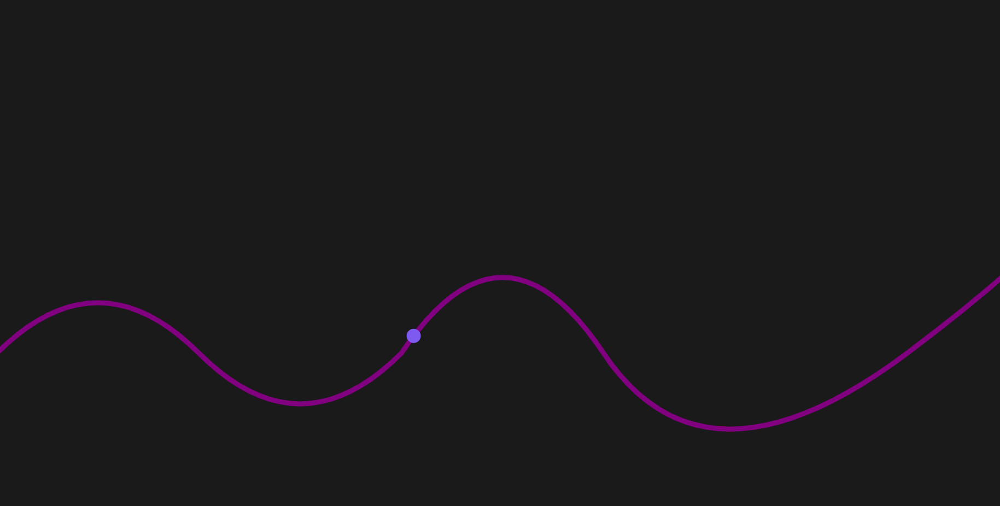

# Smooth zigzag animation



### Setup

1. Clone the repository:

   ```bash
   git clone https://github.com/turbolukoshko/smooth-zigzag-animation.git
   ```

2. Navigate to the project directory:

   ```bash
   cd smooth-zigzag-animation
   ```

3. Open index.html file in browser
